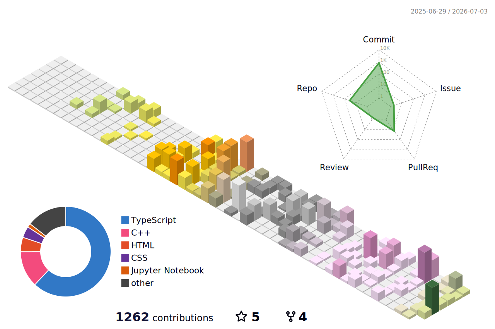

  

 
 
# 💫 About Me:
🔭**I'm currently working on:** C, Embedded Systems, IoT Devices, and Applied AI. 👯**I'm looking to collaborate on:** Open-source IoT / embedded projects, hardware prototypes, and experimental systems. 🌱**I'm currently learning:** ESP32 deep dive (Wi-Fi, BLE, MQTT), embedded systems design, and Next.js dashboards. 💬**Ask me about:** Building hardware demos, debugging sensors, IoT pipelines, and turning ideas into working prototypes. ⚡**Fun fact:** I enjoy turning random real-world data (air quality, typing stats, sensor logs) into visual and interactive web stories.

## 🌐 Socials:
 

---

## 🏗️ GitHub Activity

*3D visualization of my GitHub contributions - updated daily via GitHub Actions*

---

# 💻 Tech Stack:
         

## 🐍 Contribution Snake

  

---

### ✍️ Random Dev Quote
*March 25, 2026*

