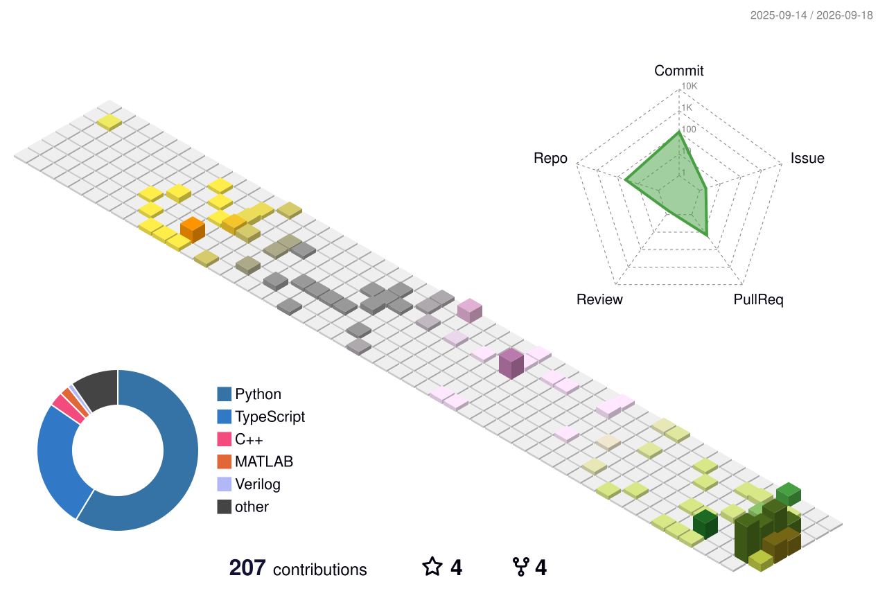

  

ECE, CS-Minor Sophomore @ TIET building embedded systems and IoT projects. I work with microcontrollers, wireless communication, PCB design, and firmware to create systems that actually work.

## Current Focus

• ESP32 firmware development

• Hardware prototyping and sensor integration

• PCB design with KiCad

• Wireless communication (Wi-Fi, BLE)

• MQTT and embedded networking

• Building complete projects from electronics to code

## Languages

 &nbsp;
 &nbsp;
 &nbsp;
 &nbsp;

## Embedded

 &nbsp;

## Hardware Design

 &nbsp;
 &nbsp;

## Simulation & Prototyping

 &nbsp;

## Development Tools

 &nbsp;
 &nbsp;

## AI Tools

 &nbsp;
 &nbsp;
 &nbsp;
 &nbsp;
 &nbsp;

## Documentation & Notes

 &nbsp;

## Connect

 &nbsp;

 &nbsp;

 &nbsp;

 &nbsp;

## Contributions

